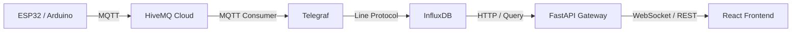

# 🪟 Janela Inteligente — IoT com Docker, HiveMQ e InfluxDB

Sistema IoT completo para controle e monitoramento de uma **janela inteligente**, integrando:

- **ESP32/Arduino** → publica medições (umidade, temperatura, posição)
- **HiveMQ Cloud (MQTT)** → broker para comunicação em tempo real
- **Telegraf** → ponte MQTT → InfluxDB
- **InfluxDB Cloud** → armazena dados de telemetria
- **FastAPI Gateway** → API + WebSocket entre front e backend
- **React + Vite** → painel web interativo

---

## 🧱 Arquitetura geral

## 🛠️ Pré-requisitos

* [Docker Desktop]()
* [Node.js 18+]()
* Conta gratuita no [HiveMQ Cloud]()
* Conta no [InfluxDB Cloud](https://cloud2.influxdata.com/)

---

## ⚙️ Estrutura do projeto

<pre class="overflow-visible!" data-start="1262" data-end="1674">

<code class="whitespace-pre!">janela-inteligente/
├─ back/                  # Backend FastAPI
│  ├─ main.py
│  └─ requirements.txt
├─ front/                 # Frontend React (Vite)
│  ├─ index.html
│  ├─ vite.config.ts
│  └─ src/
│     ├─ main.tsx
│     └─ JanelaPanel.tsx
├─ telegraf.conf          # Configuração MQTT → Influx
├─ docker-compose.yml     # Orquestra Telegraf e Gateway
└─ .env# Variáveis de ambiente
</code>

</pre>

---

## 🌍 Variáveis de ambiente (.env)

Crie um arquivo `.env` na raiz do projeto com:

<pre class="overflow-visible!" data-start="1765" data-end="2100">

<code class="whitespace-pre! language-ini"># HiveMQ
MQTT_BROKER_HOST=<seu-host>.s1.eu.hivemq.cloud
MQTT_BROKER_PORT=8883
MQTT_USERNAME=<usuario>
MQTT_PASSWORD=<senha>
DEFAULT_DEVICE_ID=dev06

# InfluxDB
INFLUX_URL=https://us-east-1-1.aws.cloud2.influxdata.com
INFLUX_TOKEN=<token>
INFLUX_ORG=<org>
INFLUX_BUCKET=TI-V-Smart-Window

# API
API_BIND=0.0.0.0
API_PORT=8080
</code>

</pre>

---

## 🐳 Subindo tudo com Docker

1. Entre na pasta do projeto:
   <pre class="overflow-visible!" data-start="2171" data-end="2217">

<code class="whitespace-pre! language-bash">cd D:\PUC\quinto_Periodo\TI5
   </code>

</pre>
2. Suba os serviços:
   <pre class="overflow-visible!" data-start="2243" data-end="2281">

<code class="whitespace-pre! language-bash">docker compose up -d
   </code>

</pre>
3. Verifique:
   <pre class="overflow-visible!" data-start="2300" data-end="2394">

<code class="whitespace-pre! language-bash">docker ps
   docker logs -f janela-gateway
   docker logs -f janela-telegraf
   </code>

</pre>
4. Teste o backend:
   <pre class="overflow-visible!" data-start="2419" data-end="2494">

<code class="whitespace-pre! language-bash">curl http://localhost:8080/api/health
   # → {"ok": true}
   </code>

</pre>

---

## 📡 Publicando telemetria (teste)

Publique via `mosquitto_pub` ou script Python (`publisher.py`):

<pre class="overflow-visible!" data-start="2603" data-end="2860">

<code class="whitespace-pre! language-bash">mosquitto_pub -h <seu-host>.s1.eu.hivemq.cloud -p 8883 \
  --capath "C:\Program Files\Git\mingw64\ssl\certs" \
  -u <usuario> -P <senha> \
  -t sensors/dev06/telemetry -q 1 \
  -m '{"device_id":"dev06","humidity":58.3,"temp":25.4,"position":50}'
</code>

</pre>

Verifique o endpoint:

<pre class="overflow-visible!" data-start="2884" data-end="3018">

<code class="whitespace-pre! language-bash">curl "http://localhost:8080/api/telemetry/last?device_id=dev06"
# → {"humidity":58.3,"temp":25.4,"position":50,"ts":"..."}
</code>

</pre>

---

## 🧩 Rodando o Frontend

### 🔹 Modo Desenvolvimento (Vite)

<pre class="overflow-visible!" data-start="3087" data-end="3125">

<code class="whitespace-pre! language-bash">cd front
npm i
npm run dev
</code>

</pre>

Acesse: [http://localhost:5173](http://localhost:5173)

✅ O proxy do Vite manda:

* `/api` → `http://localhost:8080`
* `/ws` → `ws://localhost:8080`

### 🔹 Modo Produção (build servida pelo backend)

<pre class="overflow-visible!" data-start="3327" data-end="3423">

<code class="whitespace-pre! language-bash">cd front
npm run build
cd ..
docker compose up -d --force-recreate --no-deps gateway
</code>

</pre>

Acesse: [http://localhost:8080](http://localhost:8080)

---

## 🧠 Como funciona

* O **ESP32** publica telemetria no tópico MQTT `sensors/<device_id>/telemetry`.
* O **Telegraf** lê essas mensagens e grava no **InfluxDB** como measurement `telemetry`.
* O **Gateway FastAPI** consulta o Influx e expõe endpoints REST e WebSocket.
* O **Frontend React** exibe cards, gráficos e envia comandos via `/api/command`.

---

## 🧪 Endpoints principais

| Endpoint                                | Método | Descrição                                     |
| --------------------------------------- | ------- | ----------------------------------------------- |
| `/api/health`                         | GET     | Teste de status do backend                      |
| `/api/telemetry/last?device_id=dev06` | GET     | Último ponto (umidade, temp, posição)        |
| `/api/telemetry?last=-30m`            | GET     | Histórico para gráficos                       |
| `/api/command`                        | POST    | Envia comando MQTT (`open`,`close`,`set`) |
| `/ws`                                 | WS      | Canal de telemetria em tempo real               |

---

## 🧰 Dicas de debug

* Logs Telegraf:
  <pre class="overflow-visible!" data-start="4316" data-end="4362">

<code class="whitespace-pre! language-bash">docker logs -f janela-telegraf
  </code>

</pre>
* Logs Gateway:
  <pre class="overflow-visible!" data-start="4381" data-end="4426">

<code class="whitespace-pre! language-bash">docker logs -f janela-gateway
  </code>

</pre>
* Logs Front (modo dev): ver Console (F12) no navegador.

---

## ⚙️ Segurança e boas práticas

* Use **TLS (porta 8883)** no HiveMQ.
* Rotacione tokens e senhas no `.env`.
* Use `retained` apenas em `/state` (status do dispositivo).
* Mantenha `tag_keys = ["device_id"]` no Telegraf.
* Em produção, prefira rodar o front compilado via gateway (porta 8080).

---
